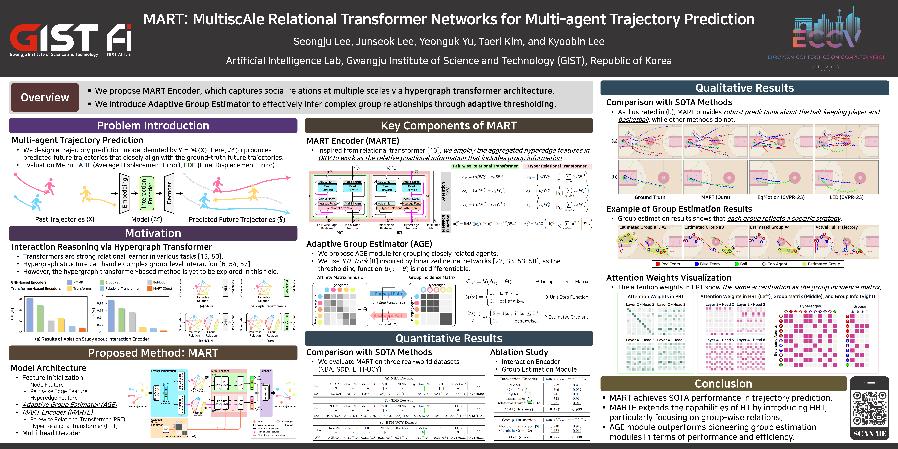

<h2 align="center"> 🛒MART🛒 <br /> MultiscAle Relational Transformer Networks for Multi-agent Trajectory Prediction </h2>
<p align="center">
  <a href="https://scholar.google.com/citations?user=Q0LR04AAAAAJ&hl=ko&oi=ao"><strong>Seongju Lee</strong></a>
  ·  
  <a href="https://scholar.google.com/citations?user=0D3_0cAAAAAJ&hl=ko&oi=ao"><strong>Junseok Lee</strong></a>
  ·
  <a href="https://scholar.google.com/citations?user=Ctm3p8wAAAAJ&hl=ko&oi=ao"><strong>Yeonguk Yu</strong></a>
  ·
  <a href="https://scholar.google.com/citations?user=ujWyzcoAAAAJ&hl=ko&oi=ao"><strong>Taeri Kim</strong></a>
  ·
  <a href="https://scholar.google.com/citations?user=QVihy5MAAAAJ&hl=ko"><strong>Kyoobin Lee</strong></a>
  <br>
  ECCV 2024
</p>

<p align="center">
  <!-- <a href=""><strong><code>Project Page</code></strong></a> -->
  <a href="https://link.springer.com/chapter/10.1007/978-3-031-72848-8_6"><strong><code>ECCV Paper</code></strong></a>
  <a href="https://arxiv.org/abs/2407.21635"><strong><code>Arxiv</code></strong></a>
  <a href="https://raw.githubusercontent.com/gist-ailab/MART/main/figures/poster.png"><strong><code>Poster</code></strong></a>
  <a href="https://github.com/gist-ailab/MART"><strong><code>Source Code</code></strong></a>
  <a href="#-citation"><strong><code>Cite MART</code></strong></a>
</p>

---
This repo is the official implementation of "***MART: MultiscAle Relational Transformer Networks for Multi-agent Trajectory Prediction (ECCV 2024)***"

## 📢 Updates
- [X] (2024.09.19) Official repository of 🛒MART🛒 is released
- [X] (2024.09.30) Update ECCV poster
- [X] (2024.11.21) Train and evaluation code for ETH-UCY dataset is uploaded
- [X] (2024.11.22) Train and evaluation code for SDD dataset is uploaded
- [X] (2025.06.24) Minor bug in PRT is fixed
- [ ] (2025.xx.xx) Source code for convert SDD dataset from PECNet is uploaded
- [ ] (2025.xx.xx) Source code for visualization is uploaded


## 🖼️ ECCV Poster


## 🚀 Getting Started

### Environment Setup


1. Set up a python environment
```
conda create -n mart python=3.8
conda activate mart
```

2. Install requirements using the following command.
```
pip install -r requirements.txt
```

## 🚂 Train & Evaluation

<!-- * Trained and evaluated on NVIDIA GeForce RTX 3090 with python 3.8. -->

### 🏀 NBA Dataset

* The dataset is included in ```./datasets/nba/```

* Train MART on the NBA dataset

  ```
  python main_nba.py --config ./configs/mart_nba.yaml --gpu $GPU_ID
  ```

* Test MART on the NBA dataset after training
  ```
  python main_nba.py --config ./configs/mart_nba.yaml --gpu $GPU_ID --test
  ```

### 🚶 ETH-UCY Dataset
* The dataset is included in ```./datasets/ethucy/```
* Train MART on the ETH-UCY dataset
  ```
  chmod +x ./scripts/train_eth_all.sh
  ./scripts/train_eth_all.sh ./configs/mart_eth.yaml $GPU_ID
  ```

* Test MART on the ETH-UCY dataset after training
  ```
  chmod +x ./scripts/test_eth_all.sh
  ./scripts/test_eth_all.sh ./configs/mart_eth.yaml $GPU_ID
  ```

### 🚁 SDD Dataset
* The dataset is included in ```./datasets/stanford/```

* Train MART on the SDD dataset

  ```
  python main_sdd.py --config ./configs/mart_sdd.yaml --gpu $GPU_ID
  ```

* Test MART on the SDD dataset after training
  ```
  python main_sdd.py --config ./configs/mart_sdd.yaml --gpu $GPU_ID --test
  ```

## 📊 Main Results
### 🏀 NBA Dataset
* Version with minor bug fixes
  ```
  minADE (4.0s): 0.728
  minFDE (4.0s): 0.902
  ```
* In paper
  ```
  minADE (4.0s): 0.727
  minFDE (4.0s): 0.903
  ```

### 🚶 ETH-UCY Dataset
```
minADE Table
       ETH    HOTEL    UNIV    ZARA1    ZARA2    AVG
       0.35    0.14    0.25    0.17    0.13    0.21    

minFDE Table
       ETH    HOTEL    UNIV    ZARA1    ZARA2    AVG
       0.47    0.22    0.45    0.29    0.22    0.33    
```

### 🚁 SDD Dataset
```
minADE: 7.43
minFDE: 11.82
```

## 🐣 How to reproduce results

### 🏀 NBA Dataset

* The checkpoint is included in ```./checkpoints/mart_nba_reproduce/```

  ```
  python main_nba.py --config ./configs/mart_nba_reproduce.yaml --gpu $GPU_ID --test
  ```
* The results will be saved in ```./results/nba_result.csv```

### 🚶 ETH-UCY Dataset

* The checkpoints are included in ```./checkpoints/mart_eth_reproduce/```
  ```
  ./scripts/test_eth_all.sh ./configs/mart_eth_reproduce.yaml $GPU_ID
  ```
* The results will be saved in ```./results/$SUBSET-NAME_result.csv```

### 🚁 SDD Dataset

* The checkpoint is included in ```./checkpoints/mart_sdd_reproduce/```
  ```
  python main_sdd.py --config ./configs/mart_sdd_reproduce.yaml --gpu $GPU_ID --test
  ```
* The results will be saved in ```./results/sdd_result.csv```


## 📝 Citation
```bibtex
@inproceedings{lee2024mart,
  title={MART: MultiscAle Relational Transformer Networks for Multi-agent Trajectory Prediction},
  author={Lee, Seongju and Lee, Junseok and Yu, Yeonguk and Kim, Taeri and Lee, Kyoobin},
  booktitle={European Conference on Computer Vision},
  pages={89--107},
  year={2024},
  organization={Springer}
}
```

## 🤗 Acknowledgement
* The part of the code about the feature initialization is adapted from ([GroupNet](https://github.com/MediaBrain-SJTU/GroupNet)).
* Thanks for sharing the preprocessed NBA dataset and dataloader ([LED](https://github.com/MediaBrain-SJTU/LED)).
* Thanks for sharing the ETH-UCY dataloader ([SGCN](https://github.com/shuaishiliu/SGCN/blob/43fe262cba44d33d98163c0c4b9dfbaf6517a646/utils.py)).
* Thanks for sharing the training code of ETH-UCY ([NPSN](https://github.com/InhwanBae/NPSN.git)).
* Thanks for sharing the preprocessed SDD dataset ([PECNet](https://github.com/HarshayuGirase/Human-Path-Prediction)).
* Thanks for providing the code of the Relational Transformer ([RT](https://github.com/CameronDiao/relational-transformer)). We implemented the RT from ```jax``` to ```pytorch```.

