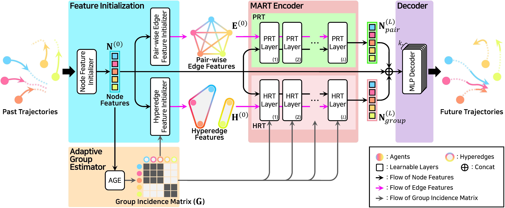

<h2 align="center"> 🛒MART🛒 <br /> MultiscAle Relational Transformer Networks for Trajectory Prediction </h2>
<p align="center">
  <a href="https://scholar.google.com/citations?user=Q0LR04AAAAAJ&hl=ko&oi=ao"><strong>Seongju Lee</strong></a>
  ·  
  <a href="https://scholar.google.com/citations?user=0D3_0cAAAAAJ&hl=ko&oi=ao"><strong>Junseok Lee</strong></a>
  ·
  <a href="https://scholar.google.com/citations?user=Ctm3p8wAAAAJ&hl=ko&oi=ao"><strong>Yeonguk Yu</strong></a>
  ·
  <a href="https://scholar.google.com/citations?user=ujWyzcoAAAAJ&hl=ko&oi=ao"><strong>Taeri Kim</strong></a>
  ·
  <a href="https://scholar.google.com/citations?user=QVihy5MAAAAJ&hl=ko"><strong>Kyoobin Lee</strong></a>
  <br>
  ECCV 2024
</p>

<p align="center">
  <a href=""><strong><code>Project Page</code></strong></a>
  <a href="https://arxiv.org/abs/2407.21635"><strong><code>ECCV Paper</code></strong></a>
  <a href="https://github.com/gist-ailab/MART"><strong><code>Source Code</code></strong></a>
  <a href="[#-citation](https://github.com/gist-ailab/MART?tab=readme-ov-file#-citation)"><strong><code>Cite MART</code></strong></a>
</p>

---
This repo is the official implementation of "***MART: MultiscAle Relational Transformer Networks for Trajectory Prediction (ECCV 2024)***"

## 📢 Updates
- [X] (2024.09.19) Official repository of 🛒MART🛒 is released


## 🏛️ Model Architecture


## 🚀 Getting Started

### Environment Setup


1. Set up a python environment
```
conda create -n mart python=3.8
conda activate mart
```

2. Install requirements using the following command.
```
pip install -r requirements.txt
```

## 🚂 Train & Evaluation

* Trained and evaluated on NVIDIA GeForce RTX 3090 with python 3.8.

* The dataset is included in ```./datasets/nba/```

* For reproducibility, we set the seed with 1.

### Train MART on the NBA dataset

```
python main_nba.py --config ./configs/mart_nba.yaml --gpu $GPU_IDs
```

### Test MART on the NBA dataset after training
```
python main_nba.py --config ./configs/mart_nba.yaml --gpu $GPU_IDs --test
```

## 📊 Main Results
### NBA dataset
* minADE_20: 0.727 [m]
* minFDE_20: 0.903 [m]

### How to reproduce results

* The checkpoint is included in ```./checkpoints/mart_nba_reproduce/```

```
python main_nba.py --config ./configs/mart_nba_reproduce.yaml --gpu $GPU_IDs --test
```

## 📝 Citation
```bibtex
@article{lee2024mart,
  title={MART: MultiscAle Relational Transformer Networks for Multi-agent Trajectory Prediction},
  author={Lee, Seongju and Lee, Junseok and Yu, Yeonguk and Kim, Taeri and Lee, Kyoobin},
  journal={arXiv preprint arXiv:2407.21635},
  year={2024}
}
```

## 🤗 Acknowledgement
* The part of the code about the feature initialization is adapted from ([GroupNet](https://github.com/MediaBrain-SJTU/GroupNet)).
* Thanks for sharing the preprocessed NBA dataset and dataloader ([LED](https://github.com/MediaBrain-SJTU/LED)).
* Thanks for providing the code of the Relational Transformer ([RT](https://github.com/CameronDiao/relational-transformer)). We implemented the RT from ```jax``` to ```pytorch```.

